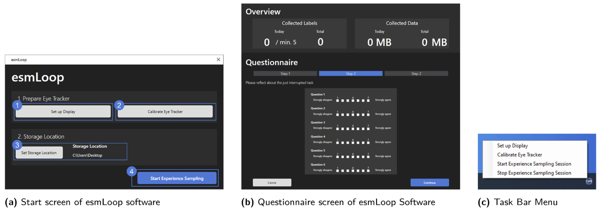

# Cognitive state detection with eye tracking in the field: an experience sampling study and its lessons learned

In the future, cognitive activity will be tracked in the same way how physical activity is tracked today. Eye-tracking technology is a promising off-body technology that provides access to relevant data for cognitive activity tracking. For building cognitive state models, continuous and longitudinal collection of eye-tracking and self-reported cognitive state label data is critical. In a field study with 11 students, we use experience sampling and our data collection system esmLoop to collect both cognitive state labels and eye-tracking data. We report descriptive results of the field study and develop supervised machine learning models for the detection of two eye-based cognitive states: cognitive load and flow. In addition, we articulate the lessons learned encountered during data collection and cognitive state model development to address the challenges of building generalizable and robust user models in the future. With this study, we contribute knowledge to bring eye-based cognitive state detection closer to real-world applications.

esmLoop is available under the MIT license and was developed:
*by Moritz Langner, Pascal Roller, Peyman Toreini, & Alexander Maedche*

## Publications

### Please Cite As

Langner, M., Toreini, P. and Maedche, A. (2024) Cognitive state detection with eye tracking in the field: an experience sampling study and its lessons learned. i-com, Vol. 23 (Issue 1), pp. 109-129. https://doi.org/10.1515/icom-2023-0035

### Further Works

The dataset collected within the field study is available here: https://dx.doi.org/10.35097/cLnVJaqFEUOYeFzh